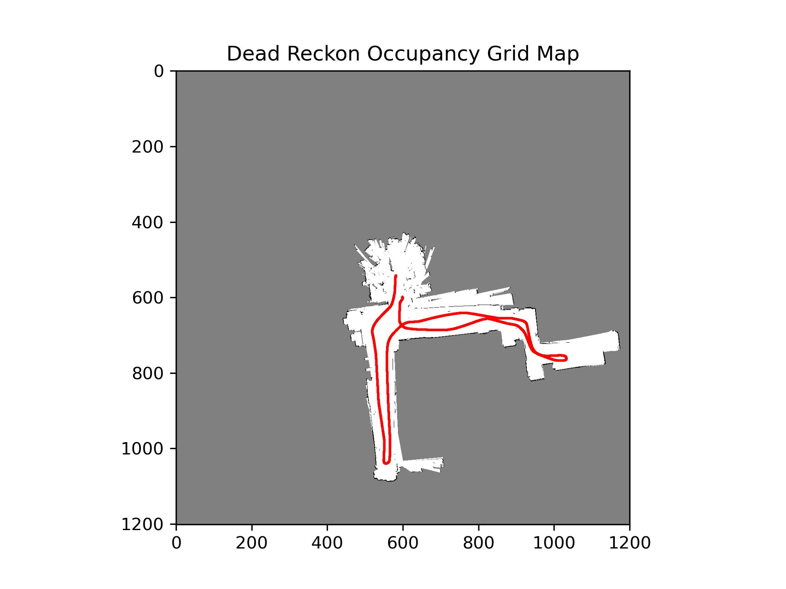
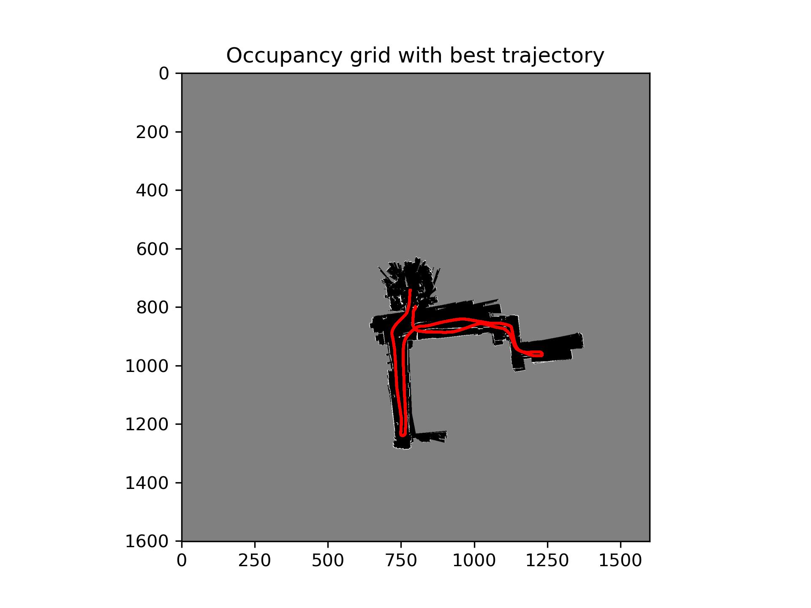
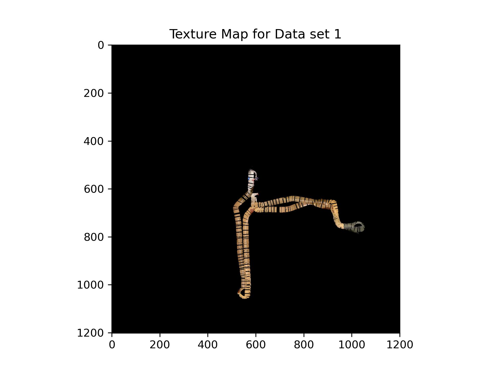

# Particle Filter SLAM
## Overview
This code is an implementation of particle filter SLAM for a mobile robot that is equipped with encoder, LiDAR scanner, IMU sensors and a camera. Differential drive robot motion and LiDAR scans are used to localise the robot and build a 2D occupancy grid map of the environment.

We have 2 sets of data obtained from a mobile robot. Each sets contain the following data:
- Encoders: A 4 * N matrix where N represents the number of time steps for which the data is provided. The rows of this matrix corresponds to encoder counts of front-right, front-left, rear-right, and rear-left wheels. In addition Unix timestamps corresponding to every column is also given.
- Inertial Measurement Unit: Linear and angular measurements from a noisy IMU sensor sampled at 40 Hz is provided along with the Unix timestamps.
- Distances measured by a 270 degrees field of view LiDAR sensor is given in the form a 1081 * N matrix where N is the number of time steps.
- RGB Images and disparity images from a RGBD camera is provided. Needs to be downloaded.

## Results
| Dead Reckon Trajectory and Map |
| :-------------------------------------: |
|  |

| Praticle Filter SLAM Trajectory and Map |
| :-------------------------------------: |
|  |

| Texture Map Output |
| :-------------------------------------: |
|  |

## Code Implementation
### 1. src/main.py
This is the main entry point for the algorithm. It redirects the program to implement particle SLAM.

### 2. src/encoder.py
Functions to convert encoder values of the wheels to velocity of the agent.

### 3. src/lidar.py
Functions written to transform lidar data into useful distance values.

### 4. src/dead_reckon.py
Functions that takes in encoder and lidar transformed values and constructs a dead reckon trajectory.

### 5. src/particle_filter.py
Functions that implements a particle filter SLAM based on the encoder and lidar values.

### 6. src/texture.py
Functions that takes the trajectory and the disparity values and RGB images and constructs a texture map as seen by the robot's head.

### 7. src/time_sync.py
As the lidar and the encoders values are sampled at different time intervals, syncing the timestamps is important to have accurate values across the timeline.

### 8. src/map_functions.py
Functions useful to plot the map and the trajectory.

### 9. src/utils.py
Functions on ray tracing is implemented.

### 10. src/motion_model_definition.py
Function which takes in a current state, and an action and outputs a future state based on the motion model.

### 11. data
This folder contains the input data of encoder, lidar and IMU.

### 12. docs
This folder contains information about sensor and also the robot dimension to apply transformations on the sensor values to bring everything in the same frame of reference.

### 13. result
This folder stores the results from the dead reckon, SLAM and the texture map outputs.